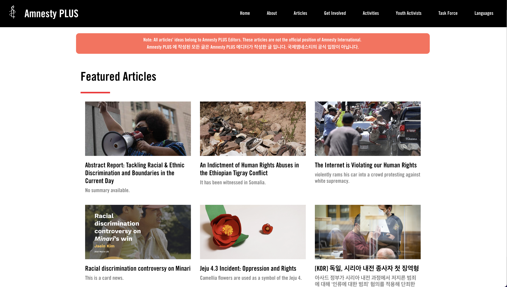
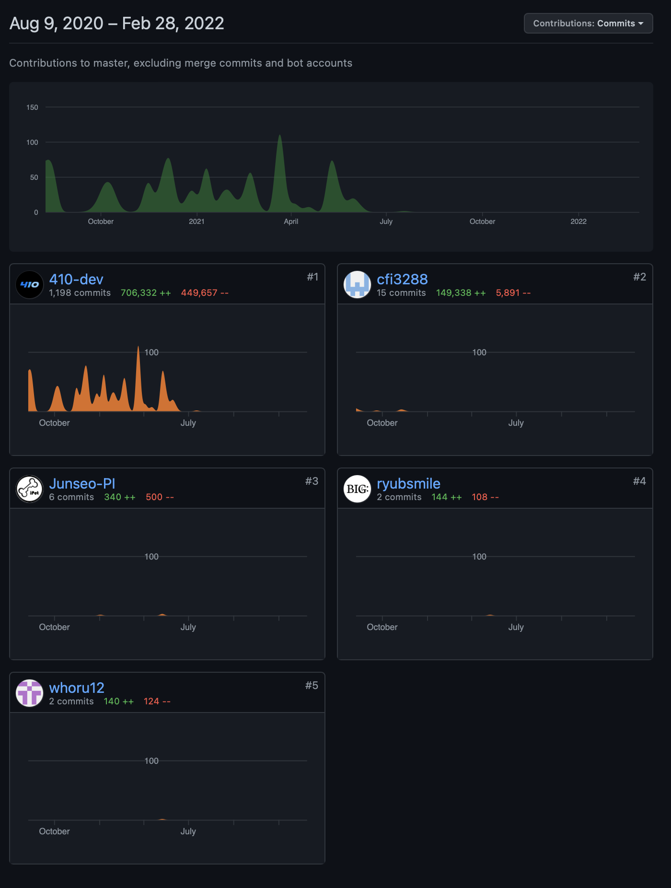

# Amnesty PLUS Foundational Website 

This repository is NOT the original repository, but a clone (not fork) with all private information (security and privacy) removed.

## What is Amnesty PLUS?

Content from about-us page:

"Amnesty PLUS is a group of Amnesty International Korea.
Our mission is to increase awareness on issues of humanitarian injustice from all around the globe by operating an interactive community where eager individuals can freely publish works about their insights and ideas.
We deliver these valuable messages through well-crafted and visually appealing articles, card news, infographics, and videos that are published on the web and shared throughout social media.
In addition, we also encourage online actions, campaigns, and donation bids affiliated with Amnesty International."

Visit https://amnestyplus.org/about-us.jsp for more information.

## What does this code do?

Basically everyting.

The server has integrated database with Apache Tomcat, so the communication of the database are done locally. Starting from the database control, the entire management of uploading / reading / managing articles and members, as well as the mailing service are done by this code.

## Contributors

[410-dev](https://github.com/410-dev)

[cfi3288](https://github.com/cfi3288)

[Junseon-Pi](https://github.com/Junseo-PI)

[ryubsmile](https://github.com/ryubsmile)

[whoru12](https://github.com/whoru12)

